# 📊 GitHub 3D Contribution Dashboard

<p align="center">
  <a href="https://github.com/Abad-87/github-3d-contribution/actions/workflows/update.yml">
    
  </a>
  
  <a href="LICENSE">
    
  </a>
</p>

Automatically generate beautiful 3D isometric calendars, language donut slices, and developer profile radar charts for your GitHub Profile README.

---

<!-- START_SECTION:dashboard -->
<div align="center">
  
  <!-- 3D Contribution Graph -->
  <a href="https://github.com/Abad-87">
    
  </a>
  <br/><br/>
  
  <!-- Radar Chart and Language Donut Chart Side-by-Side -->
  <table border="0" cellpadding="0" cellspacing="0" align="center" style="border-collapse: collapse; border: none; margin: 0 auto;">
    <tr style="border: none;">
      <td valign="top" style="border: none; padding: 0 10px;">
        
      </td>
      <td valign="top" style="border: none; padding: 0 10px;">
        
      </td>
    </tr>
  </table>
  <br/>

  <!-- Statistics Summary Table -->
  <h3>🚀 Profile Metrics Showcase</h3>
  
  <table align="center" style="width: 80%; border-collapse: collapse;">
    <thead>
      <tr style="background-color: #161b22; border-bottom: 2px solid #30363d;">
        <th align="left" style="padding: 8px; border: 1px solid #30363d;">🏆 Metric</th>
        <th align="center" style="padding: 8px; border: 1px solid #30363d;">Count</th>
        <th align="left" style="padding: 8px; border: 1px solid #30363d;">🔥 Metric</th>
        <th align="center" style="padding: 8px; border: 1px solid #30363d;">Count</th>
      </tr>
    </thead>
    <tbody>
      <tr>
        <td style="padding: 8px; border: 1px solid #30363d;">Year Contributions</td>
        <td align="center" style="padding: 8px; border: 1px solid #30363d;"><b>714</b></td>
        <td style="padding: 8px; border: 1px solid #30363d;">Current Streak</td>
        <td align="center" style="padding: 8px; border: 1px solid #30363d;"><b>7 days</b></td>
      </tr>
      <tr>
        <td style="padding: 8px; border: 1px solid #30363d;">Lifetime Commits</td>
        <td align="center" style="padding: 8px; border: 1px solid #30363d;"><b>161</b></td>
        <td style="padding: 8px; border: 1px solid #30363d;">Longest Streak</td>
        <td align="center" style="padding: 8px; border: 1px solid #30363d;"><b>15 days</b></td>
      </tr>
      <tr>
        <td style="padding: 8px; border: 1px solid #30363d;">Total Stars Received</td>
        <td align="center" style="padding: 8px; border: 1px solid #30363d;"><b>0</b></td>
        <td style="padding: 8px; border: 1px solid #30363d;">Total Forks Created</td>
        <td align="center" style="padding: 8px; border: 1px solid #30363d;"><b>3</b></td>
      </tr>
      <tr>
        <td style="padding: 8px; border: 1px solid #30363d;">Owned Repositories</td>
        <td align="center" style="padding: 8px; border: 1px solid #30363d;"><b>16</b></td>
        <td style="padding: 8px; border: 1px solid #30363d;">Pull Request Reviews</td>
        <td align="center" style="padding: 8px; border: 1px solid #30363d;"><b>0</b></td>
      </tr>
      <tr>
        <td style="padding: 8px; border: 1px solid #30363d;">Pull Requests Created</td>
        <td align="center" style="padding: 8px; border: 1px solid #30363d;"><b>7</b></td>
        <td style="padding: 8px; border: 1px solid #30363d;">Issues Created</td>
        <td align="center" style="padding: 8px; border: 1px solid #30363d;"><b>1</b></td>
      </tr>
    </tbody>
  </table>
  <br/>

  <p align="center">
    <sub>Last Generated: <b>2026-07-16 11:33:59</b> | Built with <a href="https://github.com/Abad-87/github-3d-contribution">github-3d-contribution</a></sub>
  </p>
</div>
<!-- END_SECTION:dashboard -->

---

## 🛠️ How It Works
The script fetches your contribution matrix via **GitHub GraphQL API** and REST Search API, calculates streaks, sorts languages, projects coordinates into a 3D isometric space, generates three standalone vector SVGs (plus PNG conversions), and writes them directly into the output directory and updates this README.

## 🚀 Local Run
1. Clone the repository:
   ```bash
   git clone https://github.com/Abad-87/github-3d-contribution.git
   cd github-3d-contribution
   ```
2. Install dependencies:
   ```bash
   pip install -r requirements.txt
   ```
3. Set your token (create a `.env` file or export it):
   ```env
   GH_TOKEN=your_personal_access_token
   GITHUB_USERNAME=your_username
   THEME=dark
   PALETTE=purple
   ```
4. Execute the collection and generation chain:
   ```bash
   # Fetch stats
   python src/fetch_contributions.py
   # Compile statistics
   python src/stats.py
   # Render isometric graph
   python src/generate_3d.py
   # Render donut chart
   python src/generate_donut.py
   # Render radar chart
   python src/generate_radar.py
   # Write to README
   python src/update_readme.py
   ```

## ⚙️ GitHub Actions Automation
Configure this updater to run daily on your profile repository by copying the workflow file located in `.github/workflows/update.yml`.

## 📄 License
This repository is open-source and licensed under the [MIT License](LICENSE).
